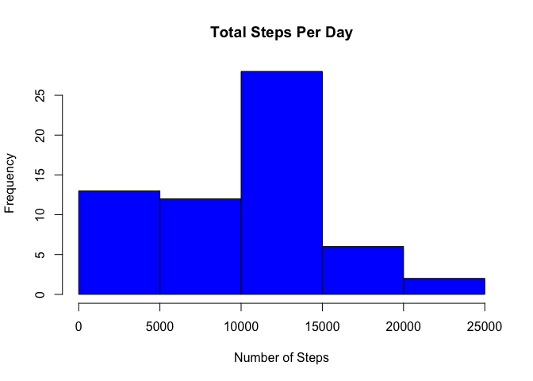
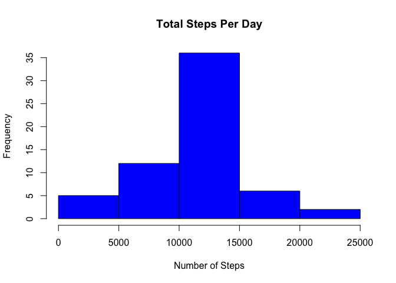
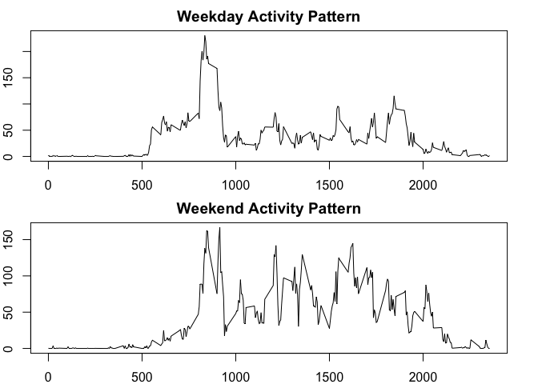

# Reproducible Research: Assignment 1
###Loading and Preprocessing the Data


```r
unzip("activity.zip")
data <- read.csv("activity.csv")
```

###What is the mean total number of steps taken per day?

Histogram of the total number of steps taken each day, calculated using "tapply":


```r
activity_day <- tapply(data$steps,data$date,sum,na.rm=TRUE)
hist(activity_day,main="Total Steps Per Day",xlab="Number of Steps",col="blue")
```

<!-- -->

The mean steps taken per day is 9,354, and the median number of steps is 10,400:


```r
summary(activity_day)
```

```
##    Min. 1st Qu.  Median    Mean 3rd Qu.    Max. 
##       0    6778   10400    9354   12810   21190
```

###What is the average daily activity pattern?

Time series plot of the 5-minute interval and average number of steps taken, averaged across all days:


```r
activity_interval <- tapply(data$steps,data$interval,mean,na.rm=TRUE)
plot(names(activity_interval),activity_interval,type="l",main="Average Daily Activity Pattern",xlab="Interval",ylab="Steps")
```

<!-- -->

The 5-minute interval that contains the maximum number of steps is the 835th interval, with around 206 steps on average:


```r
head(sort(activity_interval,decreasing=TRUE))
```

```
##      835      840      850      845      830      820 
## 206.1698 195.9245 183.3962 179.5660 177.3019 171.1509
```

###Inputting missing values

There are 2,304 missing values in the dataset:

```r
sum(is.na(data))
```

```
## [1] 2304
```

The new data frame, "data2", replaces NA values with the mean number of steps for the corresponding 5-minute interval:

```r
data2 <- data
for(x in unique(data2$interval)){data2$steps[data2$interval==x&is.na(data2$steps)]<-mean(data2$steps[data2$interval==x],na.rm=TRUE)}
```

Histogram showing the total steps per day, with missing values filled in:

```r
activity_day2 <- tapply(data2$steps,data2$date,sum,na.rm=TRUE)
hist(activity_day2,main="Total Steps Per Day",xlab="Number of Steps",col="blue")
```

<!-- -->


The mean and median steps taken per day is now 10,770. Inserting missing data using the mean for each interval had the impact of increasing both the mean and median:

```r
summary(activity_day2)
```

```
##    Min. 1st Qu.  Median    Mean 3rd Qu.    Max. 
##      41    9819   10770   10770   12810   21190
```

###Are there differences in activity patterns between weekdays and weekends?

A new factor variable with two levels – “weekday” and “weekend” indicate whether a given date is a weekday or weekend day:


```r
#Convert dates to POSIXct format and label as weekdays
data2$date<-as.POSIXct(data2$date,format='%Y-%m-%d')
days <- weekdays(data2$date)

#Replace labels with "Weekend" and "Weekday"
wkend <- days=="Saturday"|days=="Sunday"
wkday <- days=="Monday"|days=="Tuesday"|days=="Wednesday"|days=="Thursday"|days=="Friday"
newdata <- replace(days,wkend,"Weekend")
newdata <- replace(newdata,wkday,"Weekday")

#Convert to factor variable and add to dataset
factor(newdata)
data2 <- cbind(data2,newdata)
```

Panel plot of the 5-minute interval and average steps taken, averaged across weekdays and weekends:


```r
#Split the data into weekdays and weekends
wd <- data2[data2$newdata=="Weekday",]
we <- data2[data2$newdata=="Weekend",]

#Calculate the mean number of steps for each interval for weekends and weekdays
wd_plot <- tapply(wd$steps,wd$interval,mean)
we_plot <- tapply(we$steps,we$interval,mean)

#Create a panel plot
par(mfrow=c(2,1),mar=c(2,2,2,2))
plot(names(wd_plot),wd_plot,type="l",main="Weekday Activity Pattern",xlab="Interval",ylab="Steps")
plot(names(we_plot),we_plot,type="l",main="Weekend Activity Pattern",xlab="Interval",ylab="Steps")
```

<!-- -->
